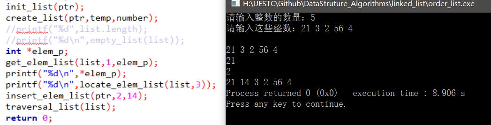
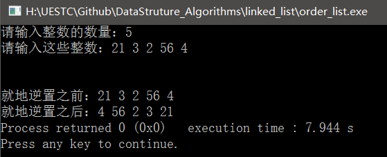

### 数据结构之线性表复习

----

#### 顺序表

关于顺序表的知识点主要有关于顺序表的抽象数据结构以及创建，插入，删除元素，查找值以及就地逆置等。

顺序表的一些抽象数据类型：

```c
//ADT 线性表抽象数据类型
//初始化顺序表
void init_list(Sqlist *ptr);
//创建顺序表
void create_list(Sqlist *ptr, int numbers[],int count);
//判断线性表是否为空
int empty_list(Sqlist List);
//清空线性表
void clean_list(Sqlist *ptr);
//将线性表中第i个数据元素返回给elem
void get_elem_list(Sqlist List, int i, int *elem);
//按值查找线性表中的某个元素，查找成功返回位置，否则返回false
int locate_elem_list(Sqlist List, int elem);
//插入新的元素
void insert_elem_list(Sqlist *ptr, int i, int elem);
//删除list中的某个元素并返回其值给elem
void delete_elem_list(Sqlist *ptr, int i, int *elem);
//返回list的长度
int length_list(Sqlist List);
```

对于每个function的详细内容见代码：`order_list.c`

实验代码结果示意图：



###### 顺序存储下线性表的就地逆置

分析：线性表的就地逆置实际上是将对称的元素进行交换，假设线性表的长度为n，将线性表中的第i个元素和第(n-i-1)个元素交换。

就地逆置的代码如下：

```c
//顺序表的就地逆置
void reverse_list(Sqlist *ptr)
{
    int len = ptr->length;
    for (int i=0;i<(len/2);i++){
        ptr->value[i] = ptr->value[i]+ptr->value[len-i-1];
        ptr->value[len-i-1] = ptr->value[i] - ptr->value[len-i-1];
        ptr->value[i] = ptr->value[i] - ptr->value[len-i-1];
    }
}

```

代码结果：



#### 单链表

关于单链表的一些知识点主要包括这些，单链表构建时的头插入，头删除，查值查找和查地址查找以及单链表的就地逆置等。

单链表的一些抽象数据类型：

```c
//初始化单链表
void init_linklist(ListNode **ptr);
//清空单链表
void clear_linkist(ListNode **ptr);
//判断单链表是否为空
int empty_linklist(ListNode *list);
//返回单链表的长度
int length_linklist(ListNode *list);
//查地址查找
void get_elem_linklist(ListNode *list, int i, int *elem);
//查值查找并返回该值得地址
ListNode *locate_elem_linklist(ListNode *list, int elem);
//在单链表中的第i个数据元素的位置插入新元素e
void insert_elem_linklist(ListNode **ptr, int i, int elem);
//删除单链表中的第i个元素并将其值保存在elem中
void delete_elem_linklist(ListNode **ptr, int i, int elem);
//遍历单链表中的所有元素并打印出来
void traverse_linklist(ListNode *list);
```

对于每个function的详细内容见代码：`single_linked_list.c`

