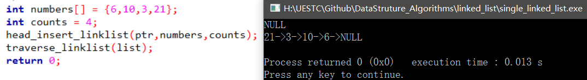
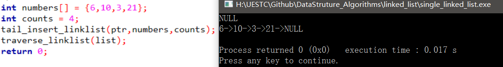
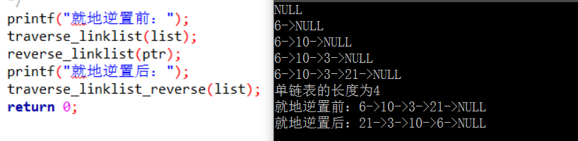
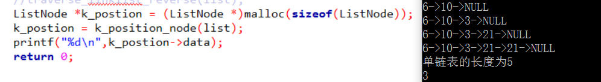
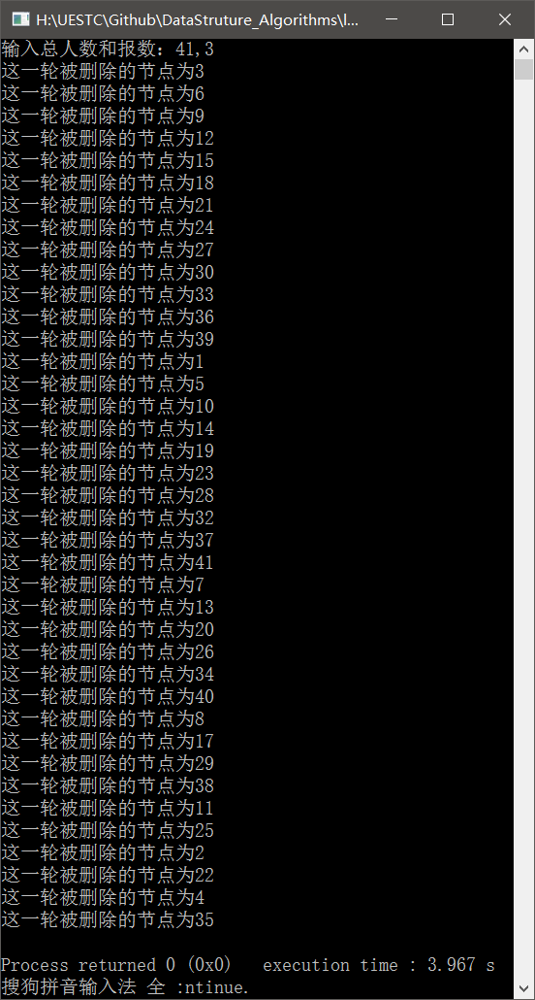

### 数据结构之线性表复习

----

[TOC]


#### 顺序表

关于顺序表的知识点主要有关于顺序表的抽象数据结构以及创建，插入，删除元素，查找值以及就地逆置等。

顺序表的一些抽象数据类型：

```c
//ADT 线性表抽象数据类型
//初始化顺序表
void init_list(Sqlist *ptr);
//创建顺序表
void create_list(Sqlist *ptr, int numbers[],int count);
//判断线性表是否为空
int empty_list(Sqlist List);
//清空线性表
void clean_list(Sqlist *ptr);
//将线性表中第i个数据元素返回给elem
void get_elem_list(Sqlist List, int i, int *elem);
//按值查找线性表中的某个元素，查找成功返回位置，否则返回false
int locate_elem_list(Sqlist List, int elem);
//插入新的元素
void insert_elem_list(Sqlist *ptr, int i, int elem);
//删除list中的某个元素并返回其值给elem
void delete_elem_list(Sqlist *ptr, int i, int *elem);
//返回list的长度
int length_list(Sqlist List);
```

对于每个function的详细内容见代码：`order_list.c`

实验代码结果示意图：


###### 顺序存储下线性表的就地逆置

分析：线性表的就地逆置实际上是将对称的元素进行交换，假设线性表的长度为n，将线性表中的第i个元素和第(n-i-1)个元素交换。

就地逆置的代码如下：

```c
//顺序表的就地逆置
void reverse_list(Sqlist *ptr)
{
    int len = ptr->length;
    for (int i=0;i<(len/2);i++){
        ptr->value[i] = ptr->value[i]+ptr->value[len-i-1];
        ptr->value[len-i-1] = ptr->value[i] - ptr->value[len-i-1];
        ptr->value[i] = ptr->value[i] - ptr->value[len-i-1];
    }
}

```

代码结果：


#### 单链表

关于单链表的一些知识点主要包括这些，单链表构建时的头插入，头删除，查值查找和查地址查找以及单链表的就地逆置等。

单链表的一些抽象数据类型：

```c
//初始化单链表
void init_linklist(ListNode **ptr);
//清空单链表
void clear_linkist(ListNode **ptr);
//判断单链表是否为空
int empty_linklist(ListNode *list);
//返回单链表的长度
int length_linklist(ListNode *list);
//查地址查找
void get_elem_linklist(ListNode *list, int i, int *elem);
//查值查找并返回该值得地址
ListNode *locate_elem_linklist(ListNode *list, int elem);
//在单链表中的第i个数据元素的位置插入新元素e
void insert_elem_linklist(ListNode **ptr, int i, int elem);
//删除单链表中的第i个元素并将其值保存在elem中
void delete_elem_linklist(ListNode **ptr, int i, int *elem);
//遍历单链表中的所有元素并打印出来
void traverse_linklist(ListNode *list);
```

对于每个function的详细内容见代码：`single_linked_list.c`

这里特别给出单链表头插法和尾插法的代码：

头插法：

```c
void head_insert_linklist(ListNode **ptr, int numbers[], int length)
{
    ListNode *temp = *ptr;
    ListNode *s;
    for (int i=0; i<length; i++){
        s = (ListNode *)malloc(sizeof(ListNode));
        if (s==NULL) return;
        s->data = numbers[i];
        s->next = temp->next;
        temp->next = s;
    }
}
```



尾插法：

```c
void tail_insert_linklist(ListNode **ptr, int numbers[], int length)
{
    ListNode *temp = *ptr;
    ListNode *s;
    for (int i=0;i<length;i++){
        s = (ListNode *)malloc(sizeof(ListNode));
        s->data = numbers[i];
        s->next = NULL;
        temp->next = s;
        temp = temp->next;
    }
}
```



###### 单链表的就地逆置

```c
void reverse_linklist(ListNode **ptr)
{
    ListNode *temp;
    temp = (*ptr)->next;
    //printf("%d\n",temp->data);
    ListNode *r;
    ListNode *s;
    s = NULL;
    while (temp != NULL){
        r = temp->next;
        //printf("%d ",r->data);
        temp->next = s;
        s = temp;
        temp = r;
    }
    //printf("%d\n",temp->data);
    (*ptr) = s;
}
```



###### 几个比较有意思的问题

- 查找给定位置的节点（中央，1/3）这类的位置（前提是只允许遍历一遍这个链表）

解题思路：快慢指针法，定义两个指针，一个一次跳跃k个节点，一个一次跳跃一个节点，当快指针到达尾部时，慢指针指向的位置刚好是1/k处。

给出代码和结果：

```c
//遍历一遍获取1/k处的节点的位置
ListNode *k_position_node(ListNode *list)
{
    ListNode *fast = list;
    ListNode *slow = list;
    while (fast){
        if (fast->next != NULL){
            ListNode *temp = fast->next;
            fast = temp->next;
        }
        else{
            break;
        }
        slow = slow->next;
    }
    return slow;
}
```



递归删除不带头结点的单链表中所有值为x的节点

给出伪代码：

```c
void recursion_delete_linklist(ListNode *&first, int x)
{
    ListNode *p;
    if (first == NULL) return;
    if (first->data == x){
        p = first;
        first = first->next;
        free(p);
        recursion_delete_linklist(first,x);
    }
    else{
        recursion_delete_linklist(first->next,x);
    }
}
```

#### 单循环链表

经典约瑟夫环问题

>据说著名犹太历史学家Josephus有过以下的故事:在罗马人占领乔塔帕特后，39 个犹太人与Josephus及他的朋友躲到一个洞中，39个犹太人决定宁愿死也不要被敌人抓到，于是决定了一个自杀方式，41个人排成一个圆圈，由第1个人开始报数，每报数到第3人，该人就必须自杀，然后再由下一个重新报数，直到所有人都自杀身亡为止。然而Josephus和他的朋友并不想遵从，他将朋友与自己安排在第16个与第31个位置，于是逃过了这场死亡游戏。

这是这个游戏的规则，如果想要通过程序去实现这个过程，我们可以考虑使用一个单循环链表来实现这个问题，将这41个人作为这个单循环链表的每一个节点。对于每一次自杀的过程我们通过删除链表中的节点来实现。整个程序大致如下：

```c
#include<stdio.h>
#include<stdlib.h>

typedef struct Node{
    int data;
    struct Node *next;
}ListNode;

void josephus_circle(int numbers, int k);

void travesal_circle(ListNode *list);

int main()
{
    int numbers;
    int k;
    printf("输入总人数和报数：");
    scanf("%d,%d",&numbers,&k);
    josephus_circle(numbers,k);
    return 0;
}

void josephus_circle(int numbers, int k)
{
    //先构建一个单循环链表
    ListNode *head = (ListNode *)malloc(sizeof(ListNode));
    head->next = NULL;
    ListNode *s = head;
    ListNode *p;
    for (int i=0;i<numbers;i++){
        p = (ListNode *)malloc(sizeof(ListNode));
        p->data = i+1;
        p->next = s->next;
        s->next = p;
        //printf("%d ",p->data);
        s=p;
    }
    //p->next = NULL;
    //travesal_circle(head);
    p->next = head->next;
    free(head);
    //不带头结点的循环链表建立完毕（此时我们有一个带尾节点的单循环链表）
    //开始进行约瑟夫环算法的流程
    /*
    这个算法主要需要进行的是节点的删除操作
    每隔k个人就删除一个节点
    */
    int length = numbers;
    ListNode *temp_1=p->next;
    ListNode *temp_2;
    ListNode *q;
    while (length>=k){
        int count=k-1;
        for (;count>0;count--){
            temp_2 = temp_1;
            temp_1 = temp_1->next;
        }
        printf("这一轮被删除的节点为%d\n",temp_1->data);
        //q = (ListNode *)malloc(ListNode);
        q = temp_1;
        temp_2->next = temp_1->next;
        temp_1 = temp_1->next;
        free(q);
        length--;
    }
    //free(head);
}

void travesal_circle(ListNode *list)
{
    ListNode *temp = list->next;
    while (temp!=NULL){
        printf("%d->",temp->data);
        temp = temp->next;
    }
    printf("NULL");
}
```

代码运行的结果与实际的情况相符合，每三个人自杀一人，当剩余不超过3人时结束循环，最终能够留下的两个人的编号分别为：16和31.



