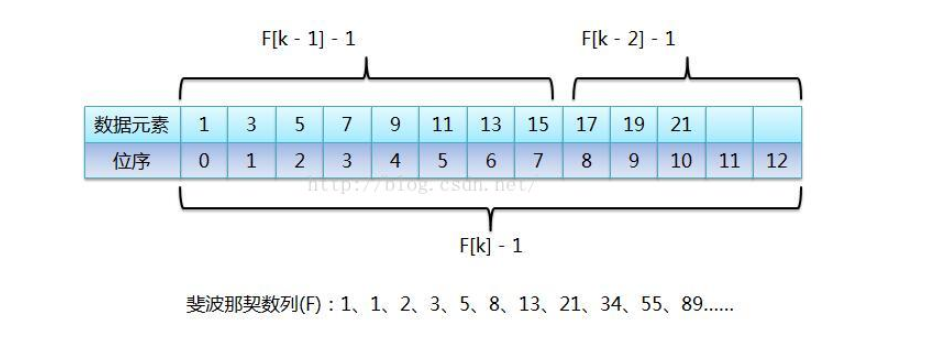

### 查找算法

[TOC]

---

#### 查找算法分类

1. 静态查找和动态查找

   静态查找和动态都是针对查找表而言的，动态表是指查找表中有删除和插入的操作。

2. 无序查找和有序查找

   无序查找：被查找数列有序无序均可；有序查找：被查找数列必须为有序数列。

**平均查找长度（Average Search Length）**：需和指定key进行比较的关键字的个数的期望值，称为查找算法在查找成功时的平均查找长度。

#### 七大查找算法

##### 顺序查找

线性查找，无序查找算法，从数据结构线性表的一端开始顺序扫描。一次将扫描到的节点关键字和给定值k作比较，相等则查找成功，否则失败。

时间复杂度$O(N)$.

代码如下：

```c
int *order_search(int *numbers, int count, int target)
{
    for (int i=0;i<count;i++){
        if (*numbers == target){
            return numbers;
        }
        numbers++;
    }
    return NULL;
}
```

##### 二分查找

**在进行二分查找前必须保证数组的元素是有序的，如果是无序的要先进行排序操作。**

二分查找也称为折半查找，属于有序查找算法，用给定值target先与中间节点的关键词作比较，中间节点将这个线性表分为两个子表，相等则查找成功，target小于中间节点的值说明target要在前面查找，令high等于mid，继续查找；否则令low=mid+1.反复查找，循环退出的条件是low大于high。

时间复杂度：$O(\log_2 N)$

代码如下：

```c
int *binary_search(int *numbers, int count, int target)
{
    int low = 0;
    int high = count-1;
    int mid = (low+high)/2;
    while (low<high){
        mid = (low+high)/2;
        if (numbers[mid] == target){
            int *result = &(numbers[mid]);
            return result;
        }
        else if (numbers[mid] < target){
            low = mid+1;
        }
        else{
            high = mid;
        }
    }
    return NULL;
}
```

##### 插值查找

插值查找的算法是对于二分查找的一种改进方式，主要改进的地方在于将二分查找变为一种自适应的二分查找，主要克服的缺点是如果要寻找的值在整个有序数组中偏前或者偏后，我们需要对mid进行调整以减少查找的时间。首先观察二分查找中的mid的位置：

$$mid = low + \frac{1}{2}(high-low)$$

现在我们考虑将这个1/2进行调整，调整的方式如下：通过target的值进行调整

$$mid = low + \frac{target - numbers[low]}{numbers[high]- numbers[low]}\times (high - low)$$

根据target在整个有序表中的位置让mid的值的变化更加靠近target，间接减少比较的次数从而缩短查找的时间。

时间复杂度：$O(\log_2(\log_2 N))$.

这里给出递归的代码如下：

```c
int *interpolation_search(int *numbers, int target, int low, int high)
{
     if (low<=high){
        int mid = low + ((target - numbers[low])/(numbers[high] - numbers[low]))*(high - low);
        if (numbers[mid] == target){
            return &(numbers[mid]);
        }
        if (numbers[mid] > target){
            return interpolation_search(numbers,target,low,mid-1);
        }
        if (numbers[mid] < target){
            return interpolation_search(numbers,target,mid+1,high);
        }
    }
    else{
        return NULL;
    }
}
```

##### 斐波那契查找

斐波那契查找也是二分查找的一种改进算法，通过将黄金比例的概念运用在数列的选择查找中进行查找，提升查找效率，属于有序查找的算法。

算法的主要流程如下：在二分查找的基础上根据斐波那契数列进行分割，在斐波那契数列中找一个等于略大于查找表中元素个数的数$F(n)$，将原数组扩展为长度为$F(n)$的数组，然后进行斐波那契分割，将这$F(n)$个元素分割为$F(n-1)$和$F(n-2)$两个部分，找到target所在的那一部分进行递归知道找到target元素的位置。

斐波那契查找的算法时间复杂度还是$O(\log_2N)$与二分查找是一致的，但是其优点是只涉及加减法而不需要进行除法运算，理论上时间比二分查找少一些，但是得视具体情况而定。



代码如下：

```c
void Fibonacci(int *F, int size)
{
    F[0] = 1;
    F[1] = 1;
    for (int i=2;i<size;i++){
        F[i] = F[i-1] + F[i-2];
    }
}

int *Fibonacci_search(int *numbers, int count, int target)
{
    int low,high,mid;
    int size = 20;
    low = 0;
    high = count-1;
    int Fib[size];
    Fibonacci(Fib,size);
    int k = 0;
    //先找到一个k的值使得F(k)的值最接近于count
    while (Fib[k]-1 < high){
        k++;
    }
    int *new_numbers;
    new_numbers = (int *)malloc((Fib[k])*sizeof(int));
    memcpy(new_numbers,numbers,count);
    //将numbers中已有的所有元素复制到new_numbers中，并将后面的值补为最后一个元素的值
    for (int j=count;j<Fib[k];j++){
        new_numbers[j] = new_numbers[high];
    }
    //将数据补齐后开始进行查找
    while (low <= high){
        mid = low + Fib[k-1] - 1;
        if (new_numbers[mid] == target){
            if (mid < (count-1)) return &(new_numbers[mid]);
            else{
                return &(new_numbers[count-1]);
            }
        }
        if (new_numbers[mid] < target){
            low = mid + 1;
            k = k-2;
        }
        if (new_numbers[mid] > target){
            high = mid - 1;
            k = k-1;
        }
    }
    return NULL;
}
```

##### 树表查找

1. Binary Search Tree（二叉搜索树）

   二叉查找树是先对待查找的数据进行生成树，确保树的左分支的值小于右分支的值，然后在就行和每个节点的父节点比较大小，查找最适合的范围。 这个算法的查找效率很高，但是如果使用这种查找方法要首先创建树。

   时间复杂度：$O(\log_2 N)$.（最坏的情况可能是$O(N)$.）

2. 2-3 Tree（平衡查找树之2-3查找树）

3. Red-Black Tree（平衡查找树之红黑树）

4. B Tree / B+ Tree（B树和B+树）

树表查找总结：

二叉查找树平均查找性能不错，为$O(\log_2N)$，但是最坏情况会退化为$O(N)$ 。在二叉查找树的基础上进行优化，我们可以使用平衡查找树。平衡查找树中的2-3查找树，这种数据结构在插入之后能够进行自平衡操作，从而保证了树的高度在一定的范围内进而能够保证最坏情况下的时间复杂度。但是2-3查找树实现起来比较困难，红黑树是2-3树的一种简单高效的实现，他巧妙地使用颜色标记来替代2-3树中比较难处理的3-node节点问题。红黑树是一种比较高效的平衡查找树，应用非常广泛，很多编程语言的内部实现都或多或少的采用了红黑树。

##### 分块查找

